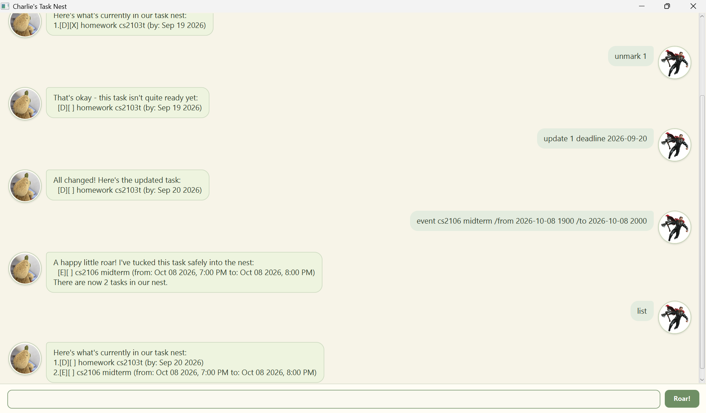

# Charlie

Charlie is a Java 25 task chatbot with a desktop chat interface. It keeps track of
todos, deadlines, and events, and saves your changes so they are available the next
time you open the app.



## Quick start

1. Install JDK 25 and open this project in IntelliJ IDEA.
2. Set the project SDK and Gradle JVM to JDK 25.
3. From the project folder, run `gradlew.bat run` on Windows or `./gradlew run`
   on macOS or Linux.
4. Type a command in the chat box and press **Enter** or click **Roar!**.

For example, enter these commands one at a time:

```text
todo borrow book
deadline return book /by 2026-09-20
list
```

See the [User Guide](docs/README.md) for every command, date and time format, and
more examples.

## Commands at a glance

| Action | Command |
| --- | --- |
| Add a todo | `todo DESCRIPTION` |
| Add a deadline | `deadline DESCRIPTION /by yyyy-MM-dd` |
| Add an event | `event DESCRIPTION /from yyyy-MM-dd HHmm /to yyyy-MM-dd HHmm` |
| Show all tasks | `list` |
| Find by description | `find KEYWORD_OR_PHRASE` |
| Find tasks on a date | `on yyyy-MM-dd` |
| Mark complete or incomplete | `mark TASK_NUMBER` or `unmark TASK_NUMBER` |
| Change one task detail | `update TASK_NUMBER FIELD NEW_VALUE` |
| Remove a task | `delete TASK_NUMBER` |
| Exit | `bye` |

## Saved tasks

Charlie saves tasks to `data/charlie.txt` relative to the folder from which you
launch it. Run Charlie from the same folder each time to load the same tasks. The
JAR does not contain this save file; Charlie reads and updates it while running.

## Build and test

Run these commands from the project folder:

| Purpose | Windows | macOS/Linux |
| --- | --- | --- |
| Run JUnit tests and Checkstyle | `gradlew.bat check` | `./gradlew check` |
| Build the executable JAR | `gradlew.bat shadowJar` | `./gradlew shadowJar` |

The JAR is written to `build/libs/charlie.jar`. Run it with
`java -jar build/libs/charlie.jar` from the project folder. JDK 25 is required to
build and run Charlie.

The exact console test cases and expected responses are in the
[UI test plan](test/ui-test-plan.md).

## AI usage

I used OpenAI Codex to assist with multiple parts of the Java code and tests, and I have verified the AI-generated output before using it in the code.
